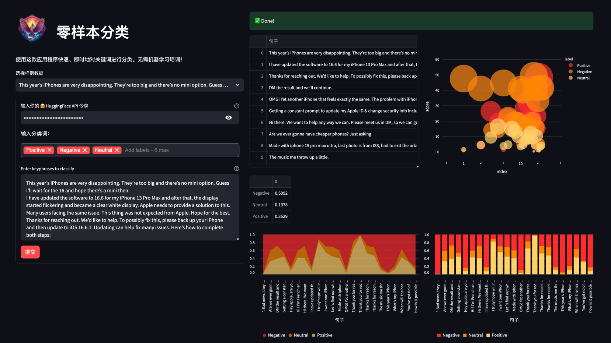
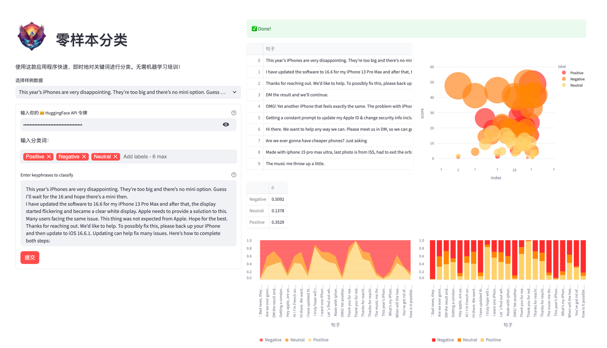

# streamlit-classifier

This project implements a zero-shot classifier App using Streamlit and HuggingFace API. 




## How to use

1. Clone the repository to your local machine.

```shell
git clone https://github.com/iDigitalWings/streamlit-classifier.git
cd streamlit-classifier
```

2. Install the dependencies with pip install -r requirements.txt.

```shell
pip install -r requirements.txt
```

3. Run the app with streamlit run app.py.

```shell
streamlit run app.py
```

## Contributing

Contributions are welcome! Please open an issue or submit a pull request if you have any suggestions or improvements.

## License

This project is licensed under the MIT License.

## More


